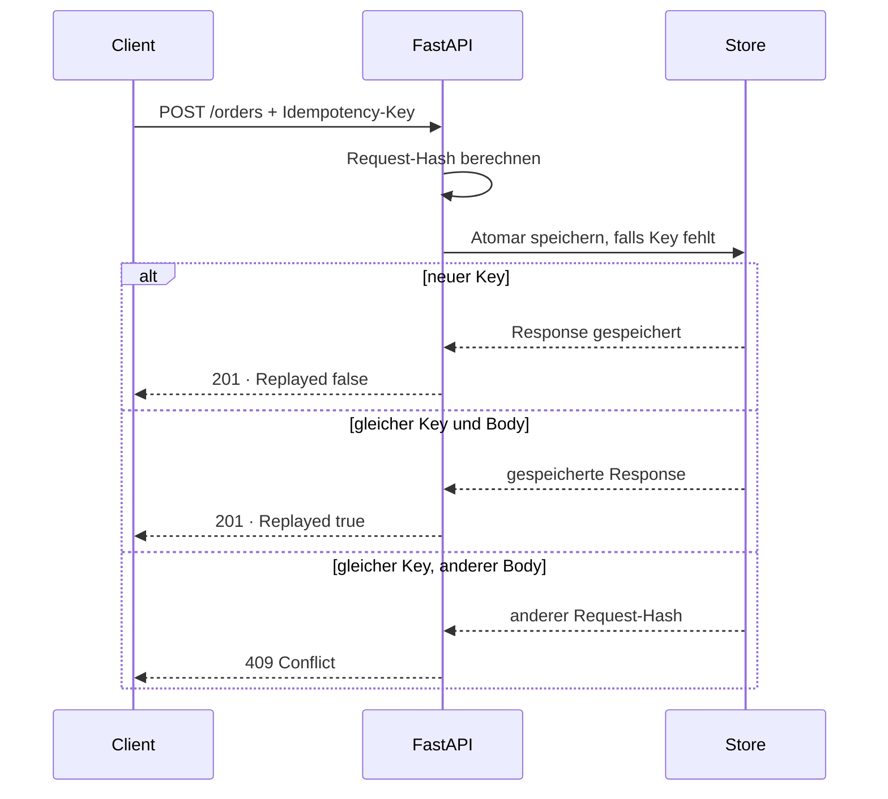

# Idempotency Demo

[](https://github.com/joeltchoffo/idempotency-demo/actions/workflows/ci.yml)

Kompakte FastAPI-Demo für sichere `POST`-Retries mit einem `Idempotency-Key`. Mehrfach gesendete und parallel eintreffende Requests erzeugen innerhalb einer App-Instanz genau eine gespeicherte Order-Response.

**Stack:** Python · FastAPI · Pydantic · SQLite · Pytest · Docker · GitHub Actions

## Warum dieses Projekt?

Netzwerkfehler und Timeouts führen häufig dazu, dass Clients einen Request wiederholen. Ohne Idempotenz können dadurch doppelte Bestellungen oder Zahlungen entstehen. Diese Demo zeigt die zentralen Bausteine einer belastbaren Lösung:

- stabiler SHA-256-Hash des Request-Bodys
- atomare Insert-if-absent-Semantik
- Replay der ursprünglichen Response
- `409 Conflict` bei gleicher ID mit verändertem Body
- Tests für sequenzielle und parallele Retries

## Ablauf



## API-Verhalten

| Situation | Status | Ergebnis |
| --- | ---: | --- |
| Erster Request mit neuem Key | `201` | Response wird gespeichert |
| Gleicher Key und gleicher Body | `201` | Ursprüngliche Response wird wiederholt |
| Gleicher Key und anderer Body | `409` | Key-Konflikt |
| Fehlender `Idempotency-Key` | `400` | Request wird abgelehnt |

Relevante Response-Header:

- `Idempotency-Replayed: false|true`
- `Idempotency-Request-Hash: <sha256>`
- `Idempotency-Key: <client-key>`

## Schnellstart mit Docker

```bash
docker build -t idempotency-demo .
docker run --rm -p 8000:8000 idempotency-demo
```

Danach:

- API: <http://127.0.0.1:8000>
- Swagger UI: <http://127.0.0.1:8000/docs>
- Healthcheck: <http://127.0.0.1:8000/health>

Das Image basiert auf Python 3.12 Slim, läuft als nicht privilegierter Benutzer und enthält einen Container-Healthcheck.

## Lokale Entwicklung

Voraussetzung: Python 3.10 oder neuer.

```bash
python -m venv .venv
source .venv/bin/activate
python -m pip install -r requirements.txt
uvicorn app.main:app --reload
```

Unter Windows PowerShell wird die Umgebung mit `.\.venv\Scripts\Activate.ps1` aktiviert.

## Beispiel

```bash
KEY=$(python -c "import uuid; print(uuid.uuid4())")

curl -i -X POST http://127.0.0.1:8000/orders \
  -H "Content-Type: application/json" \
  -H "Idempotency-Key: $KEY" \
  -d '{
    "customer_id": "cust_123",
    "currency": "EUR",
    "amount_cents": 1999,
    "items": [
      {"sku": "sku_abc", "qty": 1, "unit_price_cents": 1999}
    ]
  }'
```

Denselben Befehl mit unverändertem `KEY` erneut ausführen. Die `order_id` bleibt identisch und `Idempotency-Replayed` wechselt von `false` zu `true`.

Alternativ führt `./scripts/demo.sh` drei identische Requests automatisch aus.

## Tests und CI

```bash
python -m pytest -q
```

Die Tests prüfen:

- Replay mit identischer `order_id`
- Konflikt bei verändertem Request-Body
- Ablehnung eines fehlenden Keys
- 16 parallele Requests mit exakt einer neuen Response

GitHub Actions führt die Tests mit Python 3.10 und 3.12 aus und baut zusätzlich das Docker-Image.

## Speicheroptionen

### In-Memory

Standard für die schnelle lokale Demo:

```bash
uvicorn app.main:app --reload
```

Die Daten gehen beim Neustart verloren und werden nicht zwischen Prozessen geteilt.

### SQLite

Persistente lokale Variante:

```bash
export IDEMPOTENCY_STORE=sqlite
export IDEMPOTENCY_DB=./idempotency.sqlite3
uvicorn app.main:app --reload
```

Beide Stores verwenden atomare Insert-if-absent-Semantik. Der Memory-Store schützt den kritischen Abschnitt mit einem Lock; SQLite nutzt den Primärschlüssel und `INSERT OR IGNORE`.

## Projektstruktur

```text
idempotency-demo/
├── app/
│   ├── main.py
│   └── store.py
├── scripts/
│   └── demo.sh
├── tests/
│   └── test_idempotency.py
├── .github/workflows/ci.yml
├── Dockerfile
└── requirements.txt
```

## Produktionsgrenzen

Dieses Repository ist bewusst eine fokussierte Demo. Für ein verteiltes Produktivsystem wären zusätzlich erforderlich:

- gemeinsam genutzter Store, beispielsweise PostgreSQL oder Redis
- verteilte Atomicity über Transaktionen oder Redis `SET NX`
- TTL und Bereinigung alter Idempotency-Keys
- Idempotenz für externe Side Effects wie E-Mails und Events
- Authentifizierung, Autorisierung, Observability und Rate Limits
